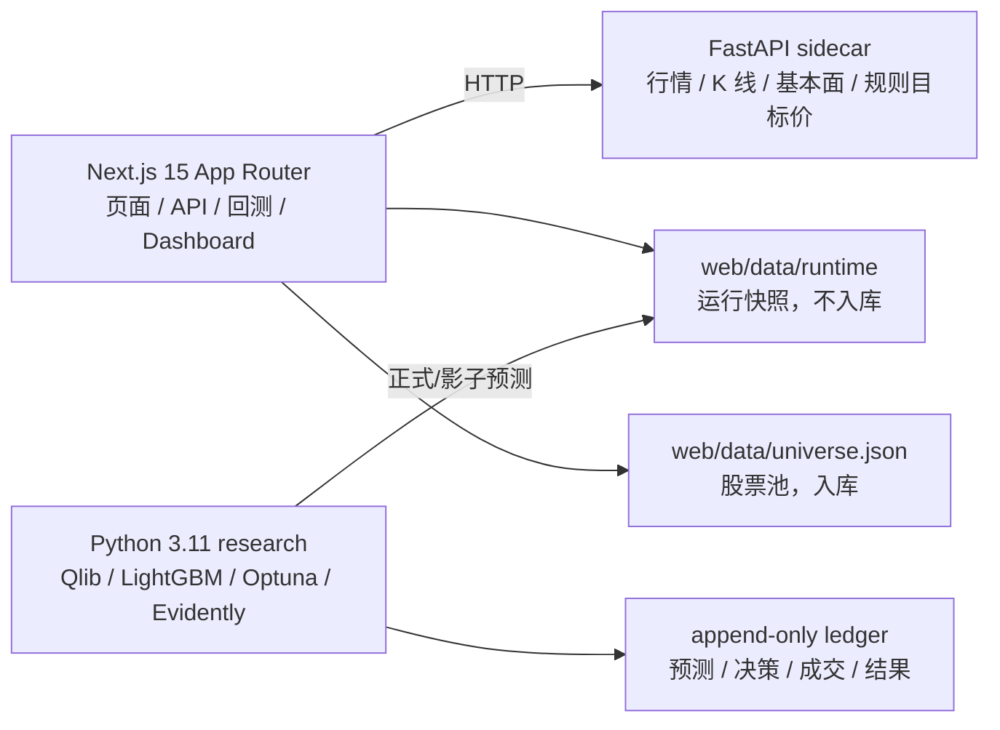

# A股量化策略站

多因子量化策略矩阵，聚焦 A 股 AI 产业链上游“卖铲人”：算力芯片、光模块、高速互连、AI 服务器、液冷、电力、IDC、存储/HBM、半导体设备与材料、AI-PCB、晶圆代工、云与 AI 基建。

系统每天收盘后生成可复现的量化模拟仓和明日交易计划，支持多策略同步观察。

## 策略矩阵

| 策略 | 代号 | 核心因子 |
|------|------|----------|
| 右侧动量 | Momentum-V1 | 价格动量 35% + 主题强度 30% + 量能确认 20% + 趋势形态 15% |
| 潮汐 | Tide | 资金流动量 + OBV 趋势 + 量价背离 + 吸筹检测 + 大单代理 |
| 棱镜 | Prism | 市场状态检测 + 因子旋转 + 波动率目标 + Hurst 指数 + 市场宽度 |

切换策略回测：`DASHBOARD_STRATEGY=tide npm run dashboard:update`

当前正式交易策略仍为 V1 规则策略。`research/` 中的 ML 系统只运行候选模型和影子模型；
模型未完成至少 60 个交易日、20 笔成交及全部样本外门槛前，不得替换 V1。

## 核心口径

- `web/data/universe.json` 是唯一提交入库的股票池源文件。
- `web/data/runtime/*.json` 是每日运行快照，不提交进 Git。
- `/api/signals` 优先使用 pyserver 实时行情；pyserver 不可用时回退 runtime 信号，并标记 `stale: true`。
- Dashboard 和首页都展示最新信号日、回测截止日和快照生成时间，避免旧日期数据混入。
- DeepSeek 只用于辅助刷新股票池，不参与交易评分。
- 目标价使用 ATR、动量、前高等规则测算，不依赖研报、新闻或大模型检索。

## 架构



## 数据职责

| 位置 | 用途 | 是否提交 |
|---|---|---|
| `web/data/universe.json` | 股票池，人工维护或 AI 辅助刷新 | 是 |
| `web/data/runtime/backtest.json` | 量化模拟仓、回测、交易记录、固定策略参数 | 否 |
| `web/data/runtime/signals.json` | 明日交易计划 | 否 |
| `web/data/runtime/analyst.json` | 现价与规则目标价快照 | 否 |
| `web/data/runtime/meta.json` | 生成时间、股票池数量等元信息 | 否 |
| `pyserver/cache.db` | 原始行情、K 线、spot、fundamental、目标价缓存 | 否 |
| `web/.cache/web.db` | DeepSeek 与接口临时缓存 | 否 |
| `research/runtime/data` | 2018 年至今全 A 股分区 Parquet | 否 |
| `research/runtime/ledger.db` | 追加式决策与结果账本 | 否 |
| `research/runtime/registry` | 候选、正式与回滚模型状态 | 否 |

## 快速开始

### 1. 启动 Python sidecar

```bash
cd pyserver
cp env.example .env
# 在 .env 中设置 TUSHARE_TOKEN
uv sync
uv run uvicorn main:app --port 8001 --reload
```

### 2. 启动 Web

```bash
cd web
npm install
cp env.example.txt .env.local
npm run dev
```

本地入口：<http://localhost:3000>

如果需要使用 3100 端口：

```bash
cd web
npm run dev -- --port 3100
```

## 日常刷新

每天收盘后的唯一人工入口：

```bash
cd web
npm run daily:close
```

该命令会按顺序完成：启动或复用 pyserver、刷新本地行情与回测、校验当日完整收盘与股票池全量覆盖、
运行 Python/TypeScript/单元测试/生产构建体检、部署服务器、启动本地 3100 页面，并验收本地与服务器的首页、Dashboard 和信号 API。
任一硬门槛失败都会停止部署，不会把旧快照当作今日数据。结构化运行结果写入
`web/data/runtime/daily-close-health.json`（不入库）。

底层数据刷新命令仍保留，仅用于调试：

```bash
cd web
npm run dashboard:update
```

该命令会刷新行情缓存、用固定策略参数重建回测、生成 latestPlan，并写入 `web/data/runtime`。
日常刷新不会自动重选参数，避免历史交易和模拟仓路径每天漂移。需要做参数诊断时，
显式运行 `DASHBOARD_OPTIMIZE=1 npm run dashboard:update`；诊断结果不能自动替换实盘化模拟仓参数，
除非人工确认后再调整固定参数。如果 pyserver 不在默认端口：

```bash
cd web
PYSERVER_URL=http://localhost:8002 npm run dashboard:update
```

运行刷新不应产生 Git 变更；如果需要改股票池，只修改并提交 `web/data/universe.json`。

`dashboard:update` 可以运行已注册模型的确定性推理，但不训练、不调参、不晋级模型。
正式模型和挑战模型分别写入 `champion-predictions.json` 和
`challenger-predictions.json`；挑战模型只在 Dashboard 展示，不会生成成交计划。

## ML 研究引擎

```bash
cd research
uv sync --group dev
uv run ashare-research health
uv run ashare-research bootstrap-qlib
uv run ashare-research qlib-data-health
uv run ashare-research qlib-benchmark --model-type linear
uv run ashare-research data-sync --start 2018-01-01 --end 2026-07-08
uv run ashare-research run-challenger --model-type linear --optuna-trials 0
uv run ashare-research run-challenger --model-type lightgbm --optuna-trials 20
```

研究引擎固定 Python 3.11，与 `pyserver` 隔离。它复用 Qlib `DatasetH`、
LightGBM/DoubleEnsemble、Optuna、MLflow 和 Evidently，并使用 D 日收盘决策、
D+1 开盘成交的 1/3/5/10 日标签。可晋级的特征版本是透明的
`ashare-core-v3`；它使用扣费后截面超额收益作为学习标签，排除当时的 ST 和上市不足 60 个交易日样本，
同时训练收益与下行风险模型。完整 Alpha158 作为独立挑战基准，不再用子集冒充 Alpha158。
公开 Qlib 数据只用于验证特征、标签和模型管线，不能产生可晋级模型。
可晋级模型必须来自通过质检的 Tushare 时点数据。

模型晋级必须通过 `research/ashare_research/promotion.py` 的全部硬门槛。
晋级证据包会绑定 OOS、冻结验收窗口、影子仓、冠军基线、数据质量和漂移报告的路径与 SHA-256；
晋级时会重新计算指标，手工修改 JSON 不能降低门槛。
每日推理前会自动回填 1/3/5/10 日结果，记录超额收益、MFE、MAE、机会成本和校准误差；
候选不足 4 只时保留现金，不把少数标的强制摊到满仓。
连续跑输 10 日、数据质量失败、特征漂移或回撤突破护栏时，
健康检查会回滚到上一模型；无上一 ML 模型时直接回到 V1。

## 多代理协作

代理任务由 `ops/agents/manifests/*.json` 限定数据截止日、允许路径、禁止路径、
产物和测试命令。可写任务一律使用独立 worktree，代理不能修改正式 runtime、
`active_model.json`、股票池或部署脚本。

```bash
python3 ops/agents/dispatch.py ops/agents/manifests/daily-data-quality.json
```

## API

实时规则信号：

```bash
curl "http://localhost:3000/api/signals?maxPositions=5&lookbackDays=140"
```

返回字段中的 `signals` 已经过组合约束，`buy` 数量不超过 `maxPositions`。如果 pyserver 不可用但 runtime 存在，接口返回 HTTP 200，并带有 `source: "static-snapshot-fallback"`、`stale: true` 和 `fallback_reason`。

## Docker

```bash
cp pyserver/env.example pyserver/.env
# 填入 TUSHARE_TOKEN
docker compose up --build
```

Web 服务暴露在 <http://localhost:3100>。pyserver 缓存和 Web runtime 快照分别写入 Docker volume。

## 服务器部署

通过 GitHub Actions 自动部署（push main 触发），或手动：

```bash
cd web
DEPLOY_HOST=$DEPLOY_USER@$DEPLOY_HOST NEXT_BASE_PATH=/a-share npm run deploy:server
```

服务器入口由 `DEPLOY_HOST` 环境变量控制，不在代码中硬编码。

## 开发命令

| 目的 | 命令 |
|---|---|
| 启动 sidecar | `cd pyserver && uv run uvicorn main:app --port 8001 --reload` |
| 启动 Web dev server | `cd web && npm run dev` |
| 收盘后全流程更新、体检与部署 | `cd web && npm run daily:close` |
| 仅更新量化模拟仓与明日计划 | `cd web && npm run dashboard:update` |
| 仅重建 Dashboard 回测数据 | `cd web && npm run dashboard:build` |
| 类型检查 | `cd web && ./node_modules/.bin/tsc --noEmit` |
| 单元测试 | `cd web && npm test` |
| 生产构建 | `cd web && npm run build` |
| 研究引擎测试 | `cd research && uv run pytest -q` |
| 研究引擎静态检查 | `cd research && uv run ruff check ashare_research tests` |
| 公开 Qlib 数据健康检查 | `cd research && uv run ashare-research qlib-data-health` |
| Alpha158 冷启动基准 | `cd research && uv run ashare-research qlib-benchmark --model-type linear` |
| 生产特征漂移检查 | `cd research && uv run ashare-research drift` |
| 生成并登记挑战模型 | `cd research && uv run ashare-research run-challenger --model-type lightgbm --optuna-trials 20` |
| 部署服务器 | `cd web && DEPLOY_HOST=$USER@$HOST NEXT_BASE_PATH=/a-share npm run deploy:server` |
| 切换策略回测 | `cd web && DASHBOARD_STRATEGY=tide npm run dashboard:update` |

## 安全与配置

- 不提交 `.env`、`.env.local`、`cache.db`、`.cache/`、`.next/`、`node_modules/` 或 API key。
- `TUSHARE_TOKEN` 只放在 `pyserver/.env`。
- 使用官方 Tushare token 时应删除 `TUSHARE_HTTP_URL`；使用第三方代理时，token 与租户有效期由代理服务商管理。
- `DEEPSEEK_API_KEY`、`DEEPSEEK_BASE_URL`、`PYSERVER_URL` 只放在 `web/.env.local`。
- `NEXT_PUBLIC_SITE_URL` 可用于设置站点 URL，默认本地地址。
- `RUNTIME_DATA_DIR` 可覆盖 runtime 快照目录，默认 `web/data/runtime`。

## 提交规则

只提交源码、规则、测试、部署脚本和 `web/data/universe.json`。每日运行生成的数据不入库。
