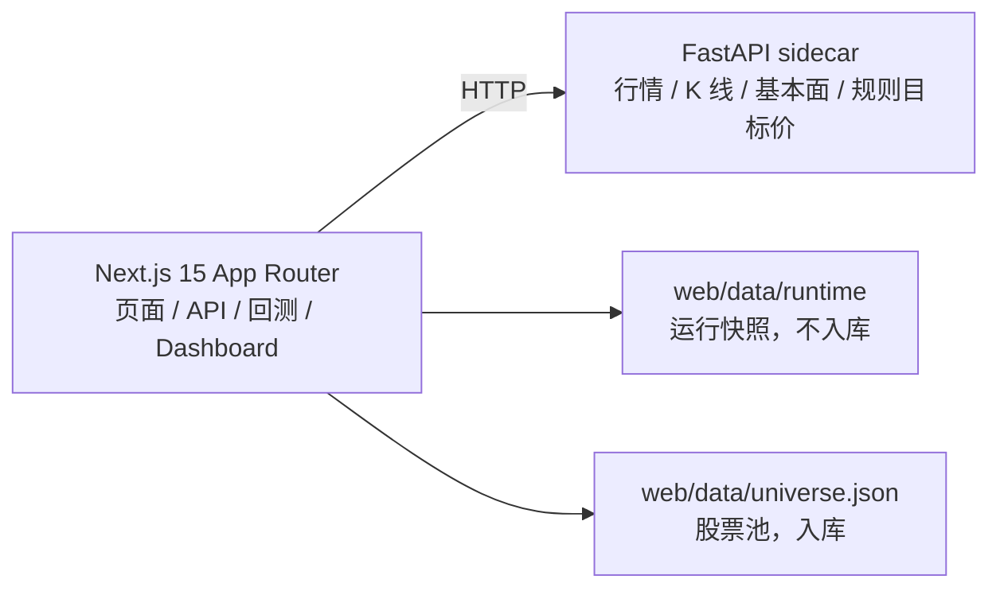

# 硅基文明消费股交易系统

这是一个面向 A 股主题交易的本地/服务器量化应用，聚焦 AI 产业链上游“卖铲人”：算力芯片、光模块、高速互连、AI 服务器、液冷、电力、IDC、存储/HBM、半导体设备与材料、AI-PCB、晶圆代工、云与 AI 基建。

系统目标不是维护静态快照，而是每天收盘后生成可复现的量化模拟仓和明日交易计划。

## 核心口径

- `web/data/universe.json` 是唯一提交入库的股票池源文件。
- `web/data/runtime/*.json` 是每日运行快照，不提交进 Git。
- `/api/signals` 优先使用 pyserver 实时行情；pyserver 不可用时回退 runtime 信号，并标记 `stale: true`。
- Dashboard 和首页都展示最新信号日、回测截止日和快照生成时间，避免旧日期数据混入。
- DeepSeek 只用于辅助刷新股票池，不参与交易评分。
- 目标价使用 ATR、动量、前高等规则测算，不依赖研报、新闻或大模型检索。

## 架构



## 数据职责

| 位置 | 用途 | 是否提交 |
|---|---|---|
| `web/data/universe.json` | 股票池，人工维护或 AI 辅助刷新 | 是 |
| `web/data/runtime/backtest.json` | 量化模拟仓、回测、交易记录、固定策略参数 | 否 |
| `web/data/runtime/signals.json` | 明日交易计划 | 否 |
| `web/data/runtime/analyst.json` | 现价与规则目标价快照 | 否 |
| `web/data/runtime/meta.json` | 生成时间、股票池数量等元信息 | 否 |
| `pyserver/cache.db` | 原始行情、K 线、spot、fundamental、目标价缓存 | 否 |
| `web/.cache/web.db` | DeepSeek 与接口临时缓存 | 否 |

## 快速开始

### 1. 启动 Python sidecar

```bash
cd pyserver
cp env.example .env
# 在 .env 中设置 TUSHARE_TOKEN
uv sync
uv run uvicorn main:app --port 8001 --reload
```

### 2. 启动 Web

```bash
cd web
npm install
cp env.example.txt .env.local
npm run dev
```

本地入口：<http://localhost:3000>

如果需要使用 3100 端口：

```bash
cd web
npm run dev -- --port 3100
```

## 日常刷新

每天收盘后运行：

```bash
cd web
npm run dashboard:update
```

该命令会刷新行情缓存、用固定策略参数重建回测、生成 latestPlan，并写入 `web/data/runtime`。
日常刷新不会自动重选参数，避免历史交易和模拟仓路径每天漂移。需要做参数诊断时，
显式运行 `DASHBOARD_OPTIMIZE=1 npm run dashboard:update`；诊断结果不能自动替换实盘化模拟仓参数，
除非人工确认后再调整固定参数。如果 pyserver 不在默认端口：

```bash
cd web
PYSERVER_URL=http://localhost:8002 npm run dashboard:update
```

运行刷新不应产生 Git 变更；如果需要改股票池，只修改并提交 `web/data/universe.json`。

## API

实时规则信号：

```bash
curl "http://localhost:3000/api/signals?maxPositions=5&lookbackDays=140"
```

返回字段中的 `signals` 已经过组合约束，`buy` 数量不超过 `maxPositions`。如果 pyserver 不可用但 runtime 存在，接口返回 HTTP 200，并带有 `source: "static-snapshot-fallback"`、`stale: true` 和 `fallback_reason`。

## Docker

```bash
cp pyserver/env.example pyserver/.env
# 填入 TUSHARE_TOKEN
docker compose up --build
```

Web 服务暴露在 <http://localhost:3100>。pyserver 缓存和 Web runtime 快照分别写入 Docker volume。

## 服务器部署

部署到子路径 `/a-share`：

```bash
cd web
DEPLOY_HOST=root@47.77.231.22 NEXT_BASE_PATH=/a-share npm run deploy:server
```

服务器入口：

- `http://47.77.231.22/a-share`
- `http://47.77.231.22/a-share/dashboard`
- `http://47.77.231.22/a-share/api/signals`

## 开发命令

| 目的 | 命令 |
|---|---|
| 启动 sidecar | `cd pyserver && uv run uvicorn main:app --port 8001 --reload` |
| 启动 Web dev server | `cd web && npm run dev` |
| 更新量化模拟仓与明日计划 | `cd web && npm run dashboard:update` |
| 仅重建 Dashboard 回测数据 | `cd web && npm run dashboard:build` |
| 类型检查 | `cd web && ./node_modules/.bin/tsc --noEmit` |
| 单元测试 | `cd web && npm test` |
| 生产构建 | `cd web && npm run build` |
| 部署服务器 | `cd web && DEPLOY_HOST=root@服务器IP NEXT_BASE_PATH=/a-share npm run deploy:server` |

## 安全与配置

- 不提交 `.env`、`.env.local`、`cache.db`、`.cache/`、`.next/`、`node_modules/` 或 API key。
- `TUSHARE_TOKEN` 只放在 `pyserver/.env`。
- `DEEPSEEK_API_KEY`、`DEEPSEEK_BASE_URL`、`PYSERVER_URL` 只放在 `web/.env.local`。
- `NEXT_PUBLIC_SITE_URL` 可用于设置站点 URL，默认本地地址。
- `RUNTIME_DATA_DIR` 可覆盖 runtime 快照目录，默认 `web/data/runtime`。

## 提交规则

只提交源码、规则、测试、部署脚本和 `web/data/universe.json`。每日运行生成的数据不入库。
