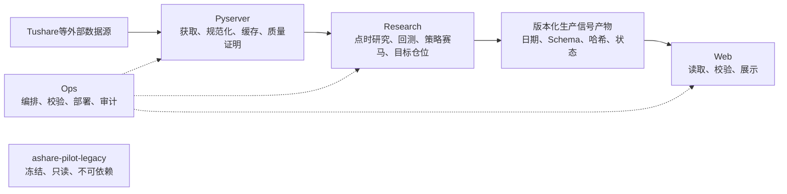

# 架构治理入口

本目录记录 `ashare-pilot` 生产项目已接受的系统边界。历史产品冻结到独立的
`ashare-pilot-legacy` 项目；生产项目不兼容、不调用也不部署旧项目。

## 已接受决定

| 决定 | 状态 | 解决的问题 |
|---|---|---|
| [ADR-001：生产计算权威](decisions/ADR-001-production-authority.md) | 已接受 | 谁负责生产策略、回测和信号 |
| [ADR-002：股票范围如何确定](decisions/ADR-002-universe-policy.md) | 已接受 | 中证800与AI观察池如何共存 |
| [ADR-003：系统异常时允许做什么](decisions/ADR-003-degraded-operation.md) | 已接受 | 数据或模型异常时是否交易、减仓或清仓 |
| [ADR-004：新旧项目物理分离](decisions/ADR-004-project-separation.md) | 已接受 | 历史实现如何退出生产代码树 |

## 配套说明

- [系统口径与接口总账](CONTRACT_CATALOG.md)
- [模块职责与变更权限](OWNERSHIP.md)
- [生产与Legacy文件归属](PROJECT_SPLIT.md)
- [弱模型任务模板](../../ops/agents/TASK_TEMPLATE.md)

## 目标数据流

生产项目内部采用模块化单仓库，不以微服务数量衡量成熟度。Legacy是另一个物理
项目，不是生产项目的模块。低耦合的标准是职责单一、依赖方向清晰、跨模块只
通过可校验契约通信，并且生产构建不需要Legacy存在。

## 落地阶段

1. **治理底座**：决策、职责、契约目录、项目拆分清单和任务模板。
2. **物理拆分**：冻结Legacy，删除生产树中的旧实现，逐项审计可迁移模块。
3. **机器约束**：Schema、契约测试、CI门禁、Agent权限、代码审批。
4. **生产实现**：接通Python生产推理、只读产品层和分阶段运维。
5. **生产验收**：回放、影子运行、异常演练、发布和回滚验证。

阶段1不改变策略、股票池、运行数据或部署行为。阶段2必须使用独立任务执行，
且先保护原工作区中的未提交成果。
