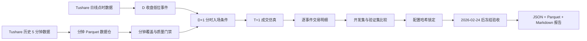

# A股投资助手 V1.1 开发计划

## 主题

历史分钟数据仓、低位反弹事件研究与 D+1 成交仿真

## 0. 执行角色

- 实现：Qoder
- 代码与研究验收：Codex
- 最终是否进入产品、影子盘或生产策略：用户单独确认

Qoder 只完成本文定义的 V1.1 研究版本。未经用户明确授权，不得把研究结果接入真实持仓、买卖建议、自动化盯盘、V1 信号或模型晋级流程。

## 1. 当前基线

截至 2026-07-24，项目已经具备：

1. `pyserver` 的历史分钟线接口 `GET /minute-klines`。
2. Tushare `stk_mins` 历史 `1min/5min/15min/30min/60min` 数据。
3. 明确的 `realtime: false` 标志，不能把该接口用于实时盯盘。
4. `research/` 中已有日线点时数据同步、特征、D 收盘决策、D+1 开盘执行、OOS、影子账户和晋级门禁。
5. V1 仍是唯一生产策略，研究代码不得覆盖 V1 曲线、信号历史和执行记录。
6. 当前 `research/runtime/data/` 尚无完整日线 Parquet，真实事件研究前仍需运行现有 `data-sync`。

当前缺口：

1. 分钟数据还没有进入 `research` 数据仓。
2. 没有分钟数据质量报告和增量同步机制。
3. 日线回测只能把成交简化为 D+1 开盘，无法比较开盘买入、分时止跌、VWAP 收复等执行方式。
4. 没有专门回答“低位博反弹时，哪种条件的风险后预期盈利金额和比例更高”的事件研究。
5. 没有完整模拟 A 股 T+1、涨跌停、停牌、整手、成交容量和滑点。

## 2. 本轮目标

交付一个隔离、可复现、不可自动实盘化的研究工具，回答四个问题：

1. 当前股票池历史上出现“低位急跌”后，直接抄底与等待分时确认的结果差异多大。
2. 哪种入场确认能提高净期望收益，而不是只提高胜率。
3. 在相同风险预算下，每 10,000 元仓位和每 100,000 元组合资金的预期盈利金额是多少。
4. T+1、跳空、跌停无法卖出、滑点和成交容量会把理论收益削弱多少。

主验收结果不是“必须找到一套赚钱策略”。如果证据不足或所有方案净期望为负，正确输出必须是 `no_viable_strategy`。

## 3. 硬边界

### 3.1 本轮允许修改

- `research/ashare_research/cli.py`
- `research/ashare_research/minute_data.py`，新增
- `research/ashare_research/minute_quality.py`，新增
- `research/ashare_research/minute_execution.py`，新增
- `research/ashare_research/rebound_study.py`，新增
- `research/ashare_research/rebound_report.py`，新增
- `research/config/rebound-v1.1.json`，新增
- `research/tests/test_minute_data.py`，新增
- `research/tests/test_minute_quality.py`，新增
- `research/tests/test_minute_execution.py`，新增
- `research/tests/test_rebound_study.py`，新增
- `research/README.md`
- `research/V2_DESIGN.md`，只补充 V1.1 与 V2 的边界说明，不刷新策略参数

如实际设计能用更少文件完成，可合并新增模块，但不得把分钟研究逻辑塞进 `web/lib/backtest.ts` 或 `pyserver/main.py`。

### 3.2 本轮禁止修改

- `web/data/universe.json`
- `web/data/runtime/`
- V1 规则、V1 回测参数、V1 信号历史
- `research/runtime/registry/`
- `active_model.json`
- 真实持仓或交易记录
- 自动化盯盘配置
- `pyserver/.env` 及任何密钥
- `pyserver/main.py` 和 `web/lib/pyserver.ts` 中已经完成的分钟接口
- Web 页面和 Dashboard

### 3.3 工作区保护

当前工作区已有未提交修改。Qoder 必须：

1. 开始前记录 `git status --short`。
2. 不执行 `git reset`、`git clean`、`git checkout --`、`git restore` 或自动格式化全仓。
3. 不覆盖非本任务文件中的现有修改。
4. 不自行 commit、push、merge。
5. 运行数据只写入已忽略的 `research/runtime/`。

## 4. 总体架构



分钟数据只改善执行研究，不改变 D 收盘信号的时间边界。任何 D+1 分时条件都只能决定是否执行已经在 D 收盘形成的候选，不能反过来使用 D+1 数据改写 D 日特征。

## 5. 数据契约

### 5.1 分钟原始字段

每行至少包含：

- `ts_code`
- `symbol`
- `trade_date`
- `trade_time`
- `freq`
- `open`
- `high`
- `low`
- `close`
- `volume`
- `amount`
- `source`
- `fetched_at`

固定语义：

- 时区：`Asia/Shanghai`
- `volume`：股
- `amount`：人民币元
- 原始分钟价格：未复权
- 数据源：`tushare_stk_mins`
- 实时属性：固定为 `false`

### 5.2 存储布局

使用 Zstandard Parquet：

```text
research/runtime/minute/
  raw/
    freq=5min/
      ts_code=000001.SZ/
        year=2025/
          month=01/
            part.parquet
  meta/
    coverage.json
    last-sync.json
    last-sync-error.json
```

唯一键：

```text
(ts_code, trade_time, freq)
```

增量写入必须先合并、去重、按 `trade_time` 升序，再通过临时文件原子替换。重复运行同一个区间不得增加重复行。

### 5.3 复权衔接

`stk_mins` 是未复权价格，现有日线特征使用 `adj_factor`。研究中：

1. 分时形态、VWAP 和实际成交价使用原始分钟价格。
2. 跨除权日计算收益时，使用 `price * adj_factor` 的比值。
3. 不允许把未复权分钟价格直接与复权日线高低点比较。
4. 缺少对应交易日 `adj_factor` 时，该事件必须标记为不可研究，不得填 1.0 猜测。

必须有一个除权日前后合成测试，证明不会把分红送转误判为暴跌或暴利。

## 6. 里程碑

## M0：基线与能力探测

### 任务

1. 记录开始前工作区状态和现有测试结果。
2. 用 `stk_mins` 探测 3 个不同市场板块的 A 股：
   - 主板 1 只
   - 创业板 1 只
   - 科创板 1 只
3. 分别验证 2025 年和 2026 年的 `5min` 历史数据是否可取。
4. 验证标准交易日的时间段、行数、单位和排序。
5. 如果 2025 年数据不可取，停止全量回填，输出阻断报告，不得缩短样本后继续声称策略有效。
6. 检查 `research/runtime/data/meta/coverage.json`。若日线数据仍为空，先用现有命令回填事件研究所需的 `2024-09-01` 至最新完整交易日：

```bash
uv run ashare-research data-sync \
  --start 2024-09-01 \
  --end 2026-07-23

uv run ashare-research build-features \
  --as-of 2026-07-23
```

7. 上述短区间只服务 V1.1 事件研究，不能据此声明满足 V2 模型晋级所需的 1,500 个完整交易日。
8. 若日线回填失败，真实事件研究必须标记为 `blocked_by_daily_data`；仍可完成代码和合成数据测试，但不得伪造真实结论。

### 通过标准

- 三只样本均有历史数据。
- 时间戳只落在 A 股交易时段。
- OHLC、成交量、成交额通过基本合法性检查。
- 明确记录最早可用日期和单次安全请求范围。
- 真实研究运行前，日线特征面板覆盖 `2024-09-01` 至最新完整交易日，或明确报告上游阻断。

## M1：历史分钟数据仓

### CLI

新增：

```bash
uv run ashare-research minute-probe \
  --symbols 000001,300308,688256 \
  --date 2025-07-01 \
  --freq 5min

uv run ashare-research minute-sync \
  --start 2025-01-01 \
  --end 2026-07-23 \
  --freq 5min \
  --universe ../web/data/universe.json

uv run ashare-research minute-health \
  --start 2025-01-01 \
  --end 2026-07-23 \
  --freq 5min
```

### 同步要求

1. 复用 `data_sync.build_tushare_client`，不复制凭证逻辑。
2. 默认单线程，允许显式配置最多 2 个 worker，不得无界并发。
3. 失败重试至少 3 次，指数退避。
4. `1min` 单段最多 31 个自然日。
5. `5min` 可使用更长分段，但每段必须保证理论最大行数低于 8,000；响应恰好 8,000 行时视为可能截断并自动拆段重试。
6. 支持断点续传、`--refresh`、`--symbols` 和 `--request-interval`。
7. 进度输出只显示代码、日期、行数和错误，不得输出 token、请求头或完整环境。
8. 当日数据即使接口返回，也只能以历史候选状态存储，不能标记 realtime。

### 覆盖报告

`coverage.json` 至少包含：

- 数据源与生成时间
- 起止交易日
- 频率
- 股票数
- 总行数
- 每只股票首末时间
- 重复键数量
- 非法 OHLC 数量
- 非交易时段数量
- 缺失交易日/缺失 bar 数量
- 数据覆盖率
- `passed`
- `failures`

## M2：分钟质量门禁

### 必查规则

1. `low <= min(open, close) <= max(open, close) <= high`
2. `volume >= 0`
3. `amount >= 0`
4. 时间单调且唯一。
5. 时间只能处于 `09:30-11:30`、`13:00-15:00` 的提供方合法时间集合。
6. 日线有成交但分钟数据为空时，标记缺失。
7. 停牌日不要求有分钟 bar。
8. 对普通完整交易日，5 分钟 bar 数明显少于预期时标记告警。
9. 研究区间覆盖率低于 95% 时，事件研究整体 fail closed。
10. 某个事件所需的入场或退出分钟数据缺失时，只能记为 `no_fill_data_missing`，不得用日线价格补成交。

## M3：A 股分钟成交仿真

### 必须建模

1. D 收盘形成候选，最早 D+1 买入。
2. 买入后的股份 D+1 不可卖，最早 D+2 可卖。
3. 买卖数量按 100 股整手向下取整。
4. 涨停或停牌时不能买。
5. 跌停或停牌时不能卖，退出单进入 pending，推迟到下一可成交 bar。
6. 任何 bar 的条件只能在该 bar 收盘后确认，成交使用下一 bar 开盘，避免同 bar 偷看。
7. D+1 盘中触发止损但股份未结算时，只记录风险事件，不能假定当日卖出。
8. 交易费用默认每次成交 10 bps，语义与现有 research 保持一致。
9. 固定滑点默认每侧 5 bps，可配置。
10. 单笔成交金额不得超过执行 bar 成交额的 1%，否则记为容量不足或按配置拒绝成交。
11. 缺少涨跌停价、复权因子或必要 bar 时 fail closed。

### 成交结果字段

每笔事件至少输出：

- `event_id`
- `symbol`
- `decision_date`
- `entry_signal_time`
- `entry_time`
- `entry_price_raw`
- `entry_price_with_cost`
- `shares`
- `entry_reason`
- `exit_signal_time`
- `exit_time`
- `exit_price_raw`
- `exit_price_with_cost`
- `exit_reason`
- `gross_return`
- `net_return`
- `pnl_per_10000`
- `mfe`
- `mae`
- `t1_blocked_stop`
- `pending_exit_bars`
- `no_fill_reason`

## M4：低位反弹事件研究

### 研究对象

使用 `web/data/universe.json` 作为当前研究名单，但必须按已有 `strategy_from`、`strategy_until` 和 `pool_tier` 做点时过滤。不得把尚未进入策略的股票提前放入历史截面，也不得修改股票池。

### 公共事件定义

所有入场方案共享以下 D 收盘条件：

1. 上市至少 60 个交易日。
2. 非 ST，D 日未停牌。
3. 60 日价格区间位置不高于 25%。
4. 相对 60 日最高收盘回撤至少 20%。
5. 最近 5 日收益不高于 -6%。
6. 20 日平均成交额至少 5,000 万元。
7. 全部条件只使用 D 日及以前数据。

这些值是 V1.1 的预注册研究假设，不是生产参数。Qoder 不得围绕冻结区间反复调值。

### 预注册入场方案

只比较以下 3 种，不新增无限参数搜索：

1. `next_open`
   - D+1 开盘买入，作为抄底基线。
2. `vwap_reclaim`
   - 09:45 后出现连续 2 根 5 分钟收盘价站上当日累计 VWAP。
   - 确认后在下一根 5 分钟 bar 开盘买入。
   - 14:30 后不再开新仓。
3. `higher_low_breakout`
   - 09:45 后形成一个高于前低的 5 分钟低点。
   - 收盘价同时站上累计 VWAP并突破前一根 5 分钟最高价。
   - 下一根 5 分钟 bar 开盘买入。
   - 14:30 后不再开新仓。

共同取消条件：

- D+1 跳空高开超过 3%。
- 全天没有确认。
- 涨停、停牌、数据缺失或容量不足。

### 预注册退出方案

每种入场只比较：

- 最早合法退出日开始，持有 1 个交易日。
- 持有 3 个交易日。
- 持有 5 个交易日。

共同风险规则：

- 初始止损为入场价下方 5%。
- 可卖后，5 分钟收盘确认止损，下一 bar 开盘执行。
- 固定持有期结束后，下一交易日第一根可成交 bar 退出。
- 若跌停或停牌，退出顺延并记录等待时间。

总组合数固定为 `3 入场 x 3 持有期 = 9`。不得在冻结区间追加方案或修改阈值。

### 时间切分

- 开发集：`2025-01-01` 至 `2025-09-30`
- 验证集：`2025-10-01` 至 `2026-02-23`
- 冻结验收：`2026-02-24` 至数据最新完整交易日

规则：

1. 只能用开发集观察与修正实现错误。
2. 方案选择只看开发集和验证集。
3. 冻结区间只能在配置哈希锁定后运行一次正式验收。
4. 冻结结果不得回用于修改阈值。
5. 若冻结前可用交易日少于 250 天，或有效事件少于 100 个，输出 `insufficient_evidence`。

### 方案选择规则

每个方案输出：

- 事件数
- 实际成交数
- 无法成交数及原因
- 胜率
- 平均、中央净收益
- 平均盈利
- 平均亏损
- 盈亏比
- Profit Factor
- MFE、MAE
- 5% CVaR
- 最大回撤
- 每 10,000 元仓位预期盈利
- 每 100,000 元组合资金预期盈利
- `mean_net_return / abs(CVaR_5%)`
- 按决策日分组的 block bootstrap 95% 置信区间

组合资金口径：

- 单笔风险预算为组合资金的 0.5%。
- 单票仓位上限为组合资金的 5%。
- 实际仓位还必须满足成交容量约束。
- `expected_profit_per_100k` 使用风险预算、仓位上限和样本平均净收益共同计算。

选择顺序：

1. 开发集和验证集平均净收益都必须大于 0。
2. 验证集有效成交至少 30 笔。
3. 若没有方案通过，输出 `no_viable_strategy`。
4. 通过者按验证集 `expected_profit_per_100k` 从高到低排序。
5. 并列时优先 `mean_net_return / abs(CVaR_5%)` 更高者。
6. 再并列时优先最大回撤更小者。

胜率不能作为第一排序指标。

## M5：配置锁定与研究产物

### 配置

新增 `research/config/rebound-v1.1.json`，包含：

- 版本
- 数据窗口
- 事件阈值
- 3 个入场方案
- 3 个持有期
- 费用、滑点、容量和仓位假设
- bootstrap seed

### 配置锁

开发/验证完成后生成：

```text
research/runtime/rebound-v1.1/config-lock.json
```

至少包含：

- 配置 SHA-256
- 数据覆盖报告 SHA-256
- 选中方案
- 锁定时间
- 开发/验证报告路径

冻结验收命令必须检查配置哈希一致。不一致时拒绝运行。

### CLI

新增：

```bash
uv run ashare-research rebound-study \
  --stage development \
  --config config/rebound-v1.1.json

uv run ashare-research rebound-study \
  --stage validation \
  --config config/rebound-v1.1.json

uv run ashare-research rebound-lock \
  --config config/rebound-v1.1.json

uv run ashare-research rebound-study \
  --stage frozen \
  --config config/rebound-v1.1.json
```

### 产物布局

```text
research/runtime/rebound-v1.1/<run-id>/
  manifest.json
  quality.json
  events.parquet
  trades.parquet
  summary.json
  report.md
```

`manifest.json` 至少包含：

- 运行时间
- Git commit 和 dirty 状态
- 配置哈希
- 输入数据覆盖与哈希
- 数据源
- as-of 日期
- 研究阶段
- 是否冻结
- 代码版本

`report.md` 必须用中文明确区分：

- 历史事实
- 模拟假设
- 研究结果
- 证据不足
- 不能成交样本
- 是否存在可行方案

不得把结果写成“明日推荐买入”或“保证盈利”。

## 7. 测试要求

至少新增以下回归测试：

### 分钟同步

1. 同一区间重复同步不产生重复行。
2. 跨月分区正确合并。
3. 8,000 行疑似截断时自动拆段。
4. 网络失败重试后成功。
5. 网络持续失败写错误报告且不破坏旧分区。
6. 当日响应仍标记为历史非实时。
7. 日志不包含 token。

### 数据质量

1. OHLC 非法被识别。
2. 重复时间被识别。
3. 午休时间 bar 被识别。
4. 停牌日不误报缺失。
5. 日线有成交但分钟为空时 fail。
6. 覆盖率低于 95% 时事件研究拒绝运行。

### 防未来函数

1. 修改 D+1 以后的 bar 不得改变 D 日事件是否成立。
2. 修改确认 bar 的收盘后数据不得改变该 bar 的确认结果。
3. 确认发生在 bar 收盘，成交只能使用下一 bar 开盘。
4. 冻结配置哈希变化后命令必须拒绝运行。

### A 股成交

1. D+1 买入不能 D+1 卖出。
2. D+1 触发止损时记录 `t1_blocked_stop`。
3. 涨停不能买。
4. 跌停不能卖，退出会顺延。
5. 停牌不能成交。
6. 100 股整手。
7. 费用和滑点方向正确。
8. 容量超过 bar 成交额 1% 时拒绝成交。
9. 缺少 bar 时不使用日线补成交。
10. 除权日前后收益计算正确。

### 研究汇总

1. `expected_profit_per_100k` 计算正确。
2. 方案按预注册规则选择，不按胜率选择。
3. 无方案通过时输出 `no_viable_strategy`。
4. 样本不足时输出 `insufficient_evidence`。
5. 固定 seed 下 bootstrap 结果可复现。

## 8. Qoder 自验收命令

Qoder 完成后必须运行并报告实际结果：

```bash
cd research
uv run ruff check ashare_research tests
uv run pytest -q
uv run ashare-research health
```

为防止影响既有项目，还必须运行：

```bash
cd ../pyserver
.venv/bin/python -m unittest -v test_main.py

cd ../web
npm test
./node_modules/.bin/tsc --noEmit
```

数据验收至少包括：

1. 3 只股票、30 个自然日的 5 分钟试跑。
2. 对试跑结果执行 `minute-health`。
3. 用合成数据完整跑通 development、validation、lock、frozen。
4. 真实数据至少跑通 development 阶段。
5. 两次相同输入运行的核心汇总和配置哈希一致。

若全池真实分钟回填因供应商速度需要数小时，可以把回填作为可续跑作业，但代码、试跑、覆盖报告和耗时估算必须完整。不得用 3 只股票试跑结果冒充全池研究结论。

## 9. 一票否决项

出现任一项，Codex 验收直接不通过：

1. 修改 V1、股票池、真实持仓、自动化或活动模型。
2. 把历史分钟接口用于实时盯盘。
3. 使用 D+1 数据修改 D 日候选。
4. 同一根 5 分钟 bar 既确认又按该 bar 收盘前价格成交。
5. 允许新买股份当日卖出。
6. 跌停、停牌或缺数据时仍假定成交。
7. 未处理复权口径。
8. 低覆盖率仍输出策略排名。
9. 在冻结区间调参数。
10. 把无效或负期望结果包装成推荐。
11. 日志、报告或提交内容出现密钥。
12. 重置、清理或覆盖当前工作区已有修改。

## 10. Codex 最终验收

Qoder 交付后，Codex 按以下顺序验收：

1. 检查 diff，只允许计划范围内文件。
2. 核对没有覆盖当前未提交改动。
3. 做未来函数专项代码审查。
4. 做 T+1、涨跌停、停牌、复权和成交容量专项审查。
5. 运行全部 research、pyserver、web 测试。
6. 抽取一个事件，手工逐 bar 重算入场与退出。
7. 修改一个未来 bar，验证 D 日事件和既有入场不变。
8. 重跑相同配置，核对产物哈希与汇总可复现。
9. 核对冻结配置锁。
10. 最后给出 `通过`、`有条件通过` 或 `不通过`，并列出问题。

## 11. 后续版本，不在 Qoder 本轮范围

只有 V1.1 通过 Codex 验收后，才讨论：

- V1.2：Dashboard 增加只读“低位反弹研究”页面。
- V1.3：对每日候选做影子提示，不生成真实订单。
- V2：将分钟执行质量作为 challenger 的附加评估证据。

任何后续版本仍需用户单独授权。

## 12. Qoder 交付回复格式

Qoder 最终回复必须包含：

1. 实现摘要。
2. 修改文件清单。
3. 与本文计划的偏差及原因。
4. 所有测试命令和通过数量。
5. 试跑的数据范围、股票数、行数和覆盖率。
6. 真实研究结果或明确的 `insufficient_evidence/no_viable_strategy`。
7. 未完成项和阻断项。
8. 明确声明未修改 V1、股票池、真实持仓、自动化和活动模型。
