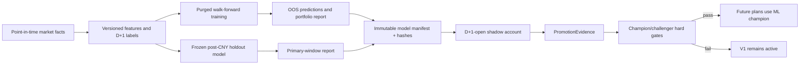

# V2 self-evolving strategy design

## Current verdict

V1 remains the only production strategy. Its 2026-02-24 to 2026-07-16
snapshot has Sharpe 1.82, maximum drawdown 26.48% and turnover 3550.69%.
It does not meet the Sharpe 3 target and must be treated as the baseline to
beat, not as a validated profitable strategy.

The first research prototype had interfaces for Qlib and a model registry but
no research data, trained model, realized shadow account or system-generated
promotion evidence. V2 replaces that incomplete path.

## Invariants

1. A decision made after the D close can only trade at the D+1 open.
2. The post-CNY 2026 window is frozen holdout evidence. No model or parameter
   evaluated on that window may train on any row from that window.
3. V1 signal history and realized trades are immutable. A challenger starts a
   separate shadow account with its own cash, positions and executions.
4. A model manifest contains immutable artifact hashes. Mutable shadow results
   live in a separate `PromotionEvidence` artifact.
5. Promotion metrics are generated from OOS, frozen holdout, shadow execution,
   data-quality and drift reports. Hand-written metrics cannot promote a model.
6. A public community dataset can run cold-start benchmarks but is never
   promotable. Production promotion requires validated Tushare data.
7. No fixed holding period is used. A position remains when its expected
   utility is close to the replacement candidate; average holding time is an
   admission check.
8. Cash is a valid target when every candidate has insufficient expected
   return after cost and downside risk.

## Data and learning flow

## Model roles

- Linear Alpha158 is the sanity baseline. If it cannot produce stable positive
  RankIC, more complex models are not justified.
- LightGBM is the first challenger because it handles nonlinear interactions
  while remaining explainable and inexpensive.
- Optuna searches at most 30 trials and treats median walk-forward RankIC and
  cross-fold dispersion as separate objectives; a volatile one-window winner
  is not selected merely for a high peak score.
- DoubleEnsemble is evaluated only after LightGBM passes the same OOS tests.
- Reinforcement learning remains out of scope until supervised challengers have
  enough realized shadow trades.

## Data source boundary

- `research/runtime/qlib/cn_data`: community Qlib data used only for cold-start
  Alpha158 benchmarks. The installed snapshot ends at 2026-07-14.
- `research/runtime/data`: Tushare point-in-time Parquet required for promotable
  models. As of 2026-07-16, the configured tenant key is expired and the token
  does not authenticate directly against the official endpoint.
- `web/data/universe.json`: point-in-time tradable AI theme universe. Full A
  shares may train cross-sectional signals, but production orders remain
  limited to the effective universe for that date.

## Completed V2 components

- D+1-open labels with 1/3/5/10-day outcomes.
- Fee-adjusted cross-sectional excess-return labels and learned downside risk.
- Point-in-time ST exclusion and a 60-trading-day listing-age filter.
- Frozen pre-2026 holdout model split with a ten-bar purge.
- OOS prediction artifacts and system evaluation for RankIC, Precision@K,
  NDCG, Sharpe, drawdown, CVaR, turnover and holding time.
- Limit/suspension-aware portfolio simulator with cash and switching buffer.
- Persistent shadow cash, positions, pending targets, executions and equity.
- Immutable model hashes, separate promotion evidence and rollback guards.
- Promotion-source hashes and metric recomputation, including champion metrics.
- Qlib public-data bootstrap with source metadata and health checks.
- Official Alpha158 next-open benchmark command.
- Evidently PSI drift reports with fail-closed inference.
- Native LightGBM TreeSHAP / linear feature contributions.
- Daily outcome rewards, calibration diagnostics and automatic gate assessment.
- Dashboard research status and optional V1/ML shadow equity comparison.

## Remaining admission work

- Restore a valid Tushare production credential and backfill 2018-present data.
- Run at least six production-data OOS folds for Linear, LightGBM and DoubleEnsemble.
- Generate V1 baseline evidence on identical dates and transaction assumptions.
- Run one candidate for at least 60 trading days and 20 closed shadow trades.
- Accumulate a real candidate shadow curve long enough for the Dashboard
  comparison to become visible.

Until every item is satisfied, the UI must say that V1 is active and that no ML
model has earned promotion.

## V1.1 与 V2 的边界

V1.1 低位反弹事件研究是一个独立的执行研究工具，与 V2 模型晋级流程完全隔离：

1. **时间边界不变**：V1.1 只研究 D+1 分时入场条件（next_open、vwap_reclaim、
   higher_low_breakout），不改变 D 收盘信号的形成时间。任何 D+1 数据都不能
   回用于修改 D 日特征或候选。

2. **不产生可晋级模型**：V1.1 输出的是事件研究统计（胜率、净收益、盈亏比、
   CVaR、bootstrap CI），不是机器学习模型。它不进入 `registry/`，不参与
   champion/challenger 比较。

3. **不接入生产**：V1.1 结果不能直接生成订单、修改持仓或触发自动化盯盘。
   若未来需要将分钟执行质量纳入 V2 评估，必须通过单独的 V1.2/V1.3 版本，
   并经用户明确授权。

4. **数据隔离**：V1.1 分钟数据存储在 `runtime/minute/`，与 V2 的
   `runtime/data/` 日线点时数据分开。两者共享 Tushare 数据源但互不覆盖。

5. **配置锁定**：V1.1 使用 `config/rebound-v1.1.json` 和 `config-lock.json`
   进行预注册研究，冻结区间（2026-02-24 后）只能运行一次正式验收，不得回
   用于调参。这与 V2 的 frozen holdout 语义一致但独立运行。
